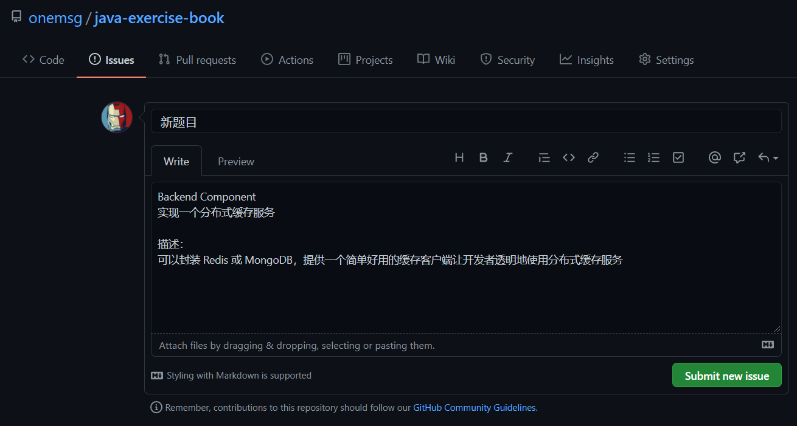
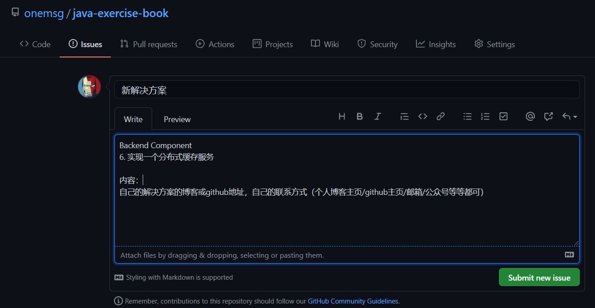

# Java Exercise Book

就像数学的练习册一样，这是一份 Java 的练习册📝

> 刷题是巩固知识、训练技能的绝佳方式  
> 我想汇集一份关于Java的试题练习测，问题驱动型地帮助Javaer一步步提升自己。当然这需要大家的参与来丰富题库——贡献你的点子，做一名**出题人**——❤你么么哒😘

## Basis Component

1. 实现一个像`juc`包中的线程池

2. 实现一个像`vertx.eventbus`的 EventDrivern 模型

3. 实现 Base64 编码/解码工具

4. 实现一个 json 序列化/反序列化工具

5. 实现一个异步 HTTP Client

## Web Application

1. 构建一个短域名服务应用

2. 构建一个代码分享应用，就像[Ubuntu Pastebin](https://paste.ubuntu.com/)

3. 构建一个类 Instagram 的图片分享平台

4. 构建一个在线购物网站

5. 构建一个个人博客

## Backend Component

1. 实现一个 RPC 框架

2. 实现一个分布式锁

3. 实现一个类 tomcat 的 Servlet 容器

4. 实现一个 Based Netty 的 HTTP 服务器

## References

- [Java 全栈知识体系 - @pdai](https://www.pdai.tech/)

- [Baeldung - EN](https://www.baeldung.com/)

-------------------------

## Todos

- 为每个问题添加更清晰的描述📃

- 为每个问题添加难度等级🎖

- 为每个问题提供实现思路/解决方案💡

## Contributings

- **如何贡献自己的题目？**

    创建新的 `Issue`, `title` 为 **`新题目`**，`comment` 填写题目的分类、名称和描述。举例：

    

- **如何贡献自己的解决方案？**

    创建新的 `Issue`，`title` 为 **`新解决方案`**，`comment` 填写题目的分类、名称、自己解决方案的地址和联系方式。举例：

    

有新题目/解决方案时，我会把内容更新到 `README` 和 `reference-solution` 中

众人拾柴火焰高，期待大家提出更多的建议，make it better 🎏
